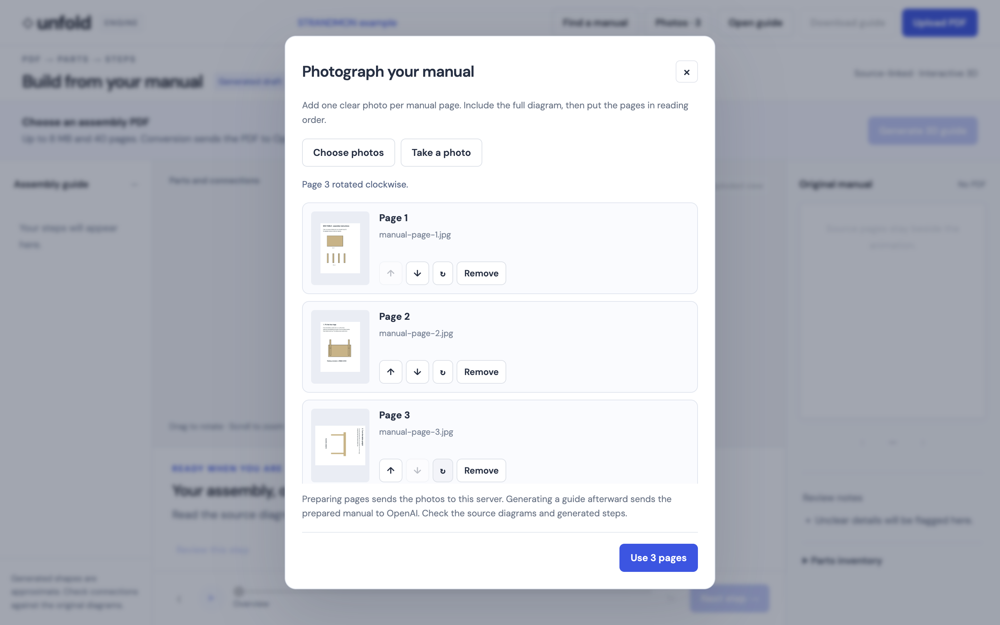
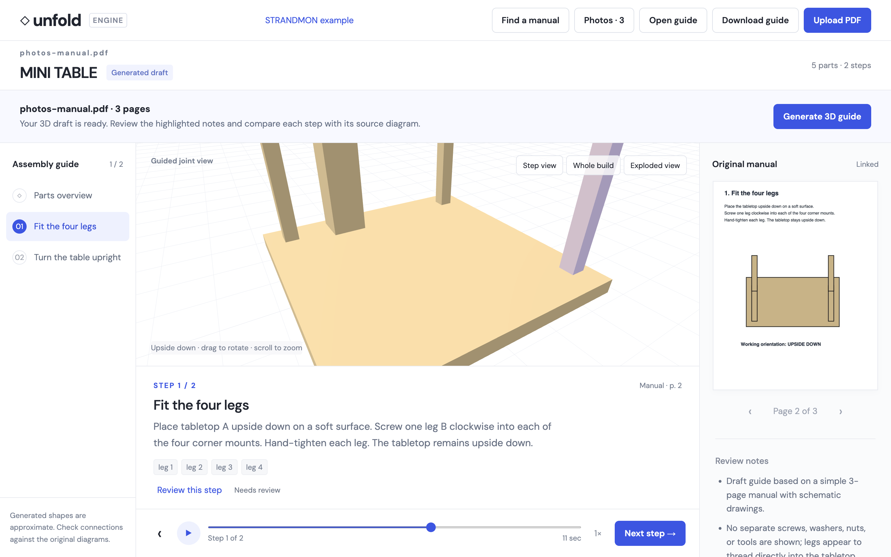
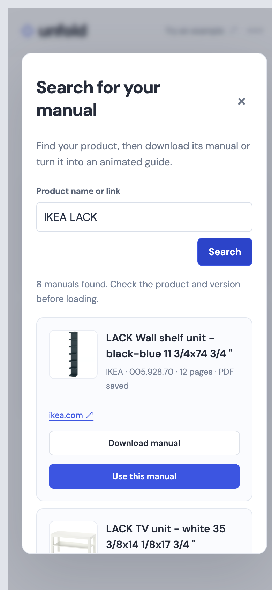
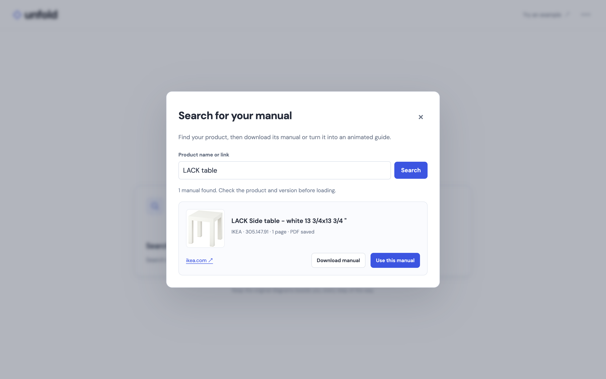

# Validation

Checked on 2026-09-13 against the local Node server using Aside CLI, its actual browser, WebGL rendering, and PDF.js.

## Automated checks

`npm test`: **44 passing tests**. Coverage includes the PDF evidence/generation pipeline, structural validation, parent-child movement, deterministic seeking, removed tools, duplicated build rotation, camera floor limits, stream cancellation, concurrency, image format/dimension/decompression limits, EXIF/quarter-turn transforms, photo page order, saved query/PDF reuse after restart, grounded source filtering, public-source DNS/redirect restrictions, and the intake/library/player UI callbacks.

Paid provider search is tested with controlled Responses API results, including citations and rejected sources. The follow-up below reuses the user’s live IKEA LACK search results to verify real manufacturer-page enrichment without another model search.

## Browser walkthrough

| Flow | Observed result |
| --- | --- |
| PDF upload → Generate | Three-page authored MINI TABLE manual produced five parts and two steps through streamed server progress. |
| Working orientation | Tabletop turns upside down once; attached legs remain above the work surface. Step two rotates the completed table upright. |
| Guided camera | Joint view exposes the active leg mount. Orbit and wheel zoom switch to free view; Step view restores guidance at the same progress. Orientation-only steps retain whole-build framing. |
| Playback | Play advances the timeline; scrubbing pauses and moves deterministically. Previous/next, whole-build and exploded controls respond. |
| Source manual | Steps one/two link to pages two/three. Independent page navigation, relink and enlarged diagram work. |
| Review/export | Step review can be saved; the downloaded JSON contains the checked-step marker. Reopened guides relink the matching original PDF. |
| Photos | Three JPEG renderings of the authored manual were uploaded, reordered, rotated and restored, then prepared as a three-page image-only PDF. A live model conversion produced five parts and the same two assembly steps, with source diagrams alongside them. |
| Library UI | Opens an empty saved library, searches locally, and presents the explicit Search the web action after no match. No external search was triggered during browser QA. |
| Small viewport | Library dialog and intake controls rendered in a 390×844 same-origin iframe viewport. The document's content width equalled its 390 px viewport. This was not a physical-phone camera test. |
| Browser errors | No page errors were recorded during the walkthrough. |

The original browser automation connection could not complete its policy check. The user requested Aside CLI, whose normal authenticated browser controls completed this walkthrough. A temporary viewport test page was removed afterward.

## Bugs caught and corrected

- The first generated table applied a whole-build flip again as a root-part action. The generation prompt and correction checks now separate handling orientation from local part movement.
- A generated camera direction ended below the support plane after a flip. Guided cameras now stay above it.
- Step view cleared exploded geometry without clearing the UI toggle. Both now agree.
- Short browser panels clipped controls. The workspace now preserves usable scene height and allows the page to scroll to playback; long desktop instructions scroll inside their panel.
- PDF replacement and loading hide previous source images and stale guide labels.

## Accuracy limits

The live STRANDMON extraction retained sixteen ordered steps on source pages 5–20. Its generated draft still contained mistaken hardware interpretations and pose assumptions. Structural checks do not establish physical accuracy; generated guides require comparison with the original manual. The prepared STRANDMON example remains separate.

Photos in the browser test were clean JPEG renderings, not handheld photographs. Blur, glare, perspective distortion, and native camera behavior still require real-device evaluation. The photo input supports JPEG/PNG and provides rotation/order controls; it does not implement deblurring or perspective correction.

This work is verified locally. The existing Sites connection could not find the saved Site; the server-backed engine and persistent library have not been hosted there.

## Rendered evidence

## Streamlined intake follow-up

The opening now presents Search for your manual online and Upload your manual. Playback and review controls appear only after a guide exists. A selected PDF or prepared photo manual opens a preview with Create animated guide. Change manual returns to the two choices; Back to guide preserves the current step and progress. Saved guide and PDF downloads live in the secondary menu.

Aside verified that the shared upload input routes three JPEG pages into the ordering/rotation editor, prepares a three-page PDF, and opens its source preview. Download manual PDF produced a real browser download. Opening a saved guide, relinking its original PDF, step playback and source-page linking still work. Automated checks cover mixed-file rejection, explicit conversion, failure recovery, and preserving the current guide during source selection.

Guide layouts at 1440×900, 900×600, 680×600, and 390×844 had no horizontal document overflow. Header actions stayed inside the header and playback remained below the scene. Scene heights were 430, 314, 362, and 369 px respectively; short viewports scroll. The initial choices also stack cleanly at 390 px.

## Product result follow-up

The user’s existing IKEA LACK search results were enriched from actual manufacturer pages, without another paid model search. Four product pages supplied exact names, photos, and assembly PDFs separately from care documents. An IKEA article-number lookup also resolved product pages for PDF-only records, including the reported side table 305.147.91, while preserving its selected PDF revision. Seven of eight saved LACK results now have official photos; the remaining PDF has no article number or verified product-page evidence.

Aside confirmed the product photos loaded, including the exact LACK side table 305.147.91, and Download manual produced real browser downloads for the side table and wall shelf unit, and Use this manual opened the 12-page LACK wall shelf PDF preview with its product name and Create animated guide. The download path does not start conversion. The result dialog fit a 390 px viewport with no horizontal overflow. Automated checks cover exact article matching, failed lookups, caching across restarts, retained PDF revisions, and safe HTML/image/PDF source handling.

## Screw lab — 2026-09-13

Implemented `/screws.html`, linked from the home page, assembly workspace and KNARREVIK screw checklist row. The mesh and binary STL share the same vertex/index data. Added automated checks for all seven metric presets and three head styles: unique seam vertices, two incident faces per edge, consistent winding, positive signed volume, nondegenerate triangles, overall length, actual socket recess, helical pitch/handedness, diameter compensation and binary STL round trip. UI checks exercise preset changes, manual dimensions, export, invalid-input export blocking, KNARREVIK source context, WebGL failure, preview geometry replacement and disposal.

All eight screw tests passed; the complete suite passed 71/71. Local HTTP checks returned 200 for the workspace and screw generator. Browser interaction/visual QA was not requested and was not performed. No slicer or physical print test has been performed; printable topology does not establish real-world thread fit or load capacity. The generator explicitly labels the default as an example and recommends correct metal spares for furniture joints.
